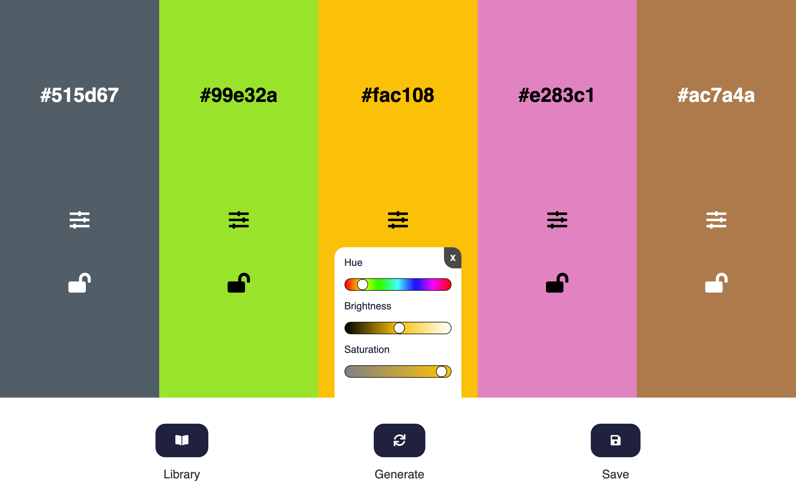

# Color Palette Generation Tool

This is a application to generate and save custom color palettes for your projects.

## Table of contents

- [Overview](#overview)
- [The challenge](#the-challenge)
- [Screenshot](#screenshot)
- [Links](#links)
- [My process](#my-process)
- [Built with](#built-with)
- [What I learned](#what-i-learned)
- [Continued development](#continued-development)
- [Useful resources](#useful-resources)
- [Author](#author)

## Overview

### The challenge

The user should be able to:

- Generate random color palettes with the Generate Button.
- Click on the hex value to copy to clipboard.
- Reveal and hide slider adjustments when clicking on the slider icon.
- Adjust hue, saturation, and brightness of colors with the slider.
- Slider backgrounds should adjust with the changing of back ground colors.
- Lock colors from being regenerated with the generate button.
- Save palettes and generate list of save palettes in library utilizing local storage in browser.
- Delete palettes from library and local storage.

### Screenshot



### Links

- GitHub URL: [https://github.com/brianlfarmerllc/color_palette](https://github.com/brianlfarmerllc/color_palette)
- Live Site URL: [https://objective-meitner-159c04.netlify.app/](https://objective-meitner-159c04.netlify.app/)

## My process

### Built with

- HTML5 markup
- CSS3
- SASS Preprocessor
- JavaScript
- Chroma.js
- Local Storage

### What I learned

I saw the idea for the project on youtube and thought I might try and recreate it. I found a very useful library that I was able to incorporate in a lot of the color manipulation functions called chroma.js. I honestly dont think I would have been able to create the project without it and I learned a lot using it.

Another thing I had never done before was incorporating click to copy functionality in a project and I found that it was simpiler than I originally thought it was going to be. To execute the copy function I had to create a textarea element and append it to the document in order to be able to run the execCommand("copy") on then destroy the element. This was a little hack I acme across in a post in stack overflow.

```js
function copyToClipboard(hex) {
  // Create / Destroy Copy Element
  const el = document.createElement("textarea");
  el.value = hex.innerText;
  document.body.appendChild(el);
  el.select();
  document.execCommand("copy");
  document.body.removeChild(el);

  // Opens Confirmation Modal
  const popup = document.querySelector(".copy-container");
  popup.classList.add("active");
  popup.children[0].classList.add("active");

  // Closes Modal After 1 Sec
  setTimeout(() => {
    popup.classList.remove("active");
    popup.children[0].classList.remove("active");
  }, 1000);
}
```

### Continued development

I would like to come back and see if I could refactor this using OOP with es6 classes to clean up the javascript a bit.

### Useful resources

- [Chroma.js](https://gka.github.io/chroma.js/) - This was a fun JavaScript library to use

## Author

- Website - [Brian Farmer](https://brianfarmerwebdev.netlify.app)
- GitHub URL: - [GitHub URL](https://github.com/brianlfarmerllc)
- Frontend Mentor - [@brianlfarmerllc](https://www.frontendmentor.io/profile/brianlfarmerllc)
